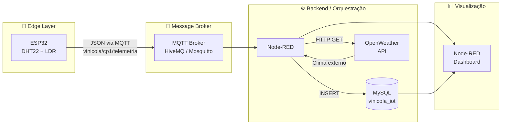

# 🍷 Checkpoint IoT — Monitoramento Inteligente de Vinícola

Sistema de monitoramento em tempo real das condições ambientais de estoque de vinhos, utilizando ESP32, sensores DHT22/LDR, protocolo MQTT, Node-RED e MySQL.

---

## Arquitetura do Sistema



### Fluxo de Dados

```
ESP32 (sensores)
  │
  ├─ Lê DHT22 → temperatura (°C) + umidade (%)
  ├─ Lê LDR   → luminosidade (0-4095)
  ├─ Classifica alertas (limites configuráveis)
  └─ Publica JSON via MQTT (QoS 1)
        │
        ▼
    MQTT Broker
        │
        ▼
    Node-RED
        │
        ├─ Parse JSON
        ├─ INSERT no MySQL (telemetria)
        ├─ HTTP GET OpenWeather → INSERT (clima_externo)
        ├─ Formata dados → Gauges (temp, umid, luz)
        ├─ Formata dados → Chart (histórico)
        └─ Switch de alertas → Toast notification
```

---

## Stack Tecnológica

| Camada         | Tecnologia               | Versão Recomendada |
|----------------|---------------------------|--------------------|
| Microcontrolador | ESP32 DevKit v1          | —                  |
| Sensor Temp/Umid | DHT22                   | —                  |
| Sensor Luz       | LDR + Resistor 10kΩ     | —                  |
| Firmware         | Arduino Framework (C++)  | ESP32 Core 2.x    |
| Protocolo        | MQTT                     | v3.1.1             |
| Broker           | HiveMQ Cloud / Mosquitto | 2.x                |
| Orquestração     | Node-RED                 | 3.x                |
| Banco de Dados   | MySQL                    | 8.x                |
| API Externa      | OpenWeatherMap           | v2.5               |
| Dashboard        | node-red-dashboard       | 3.x                |

---

## Estrutura do Repositório

```
checkpoint-iot-vinicola/
├── firmware/
│   └── firmware.ino          # Código ESP32 (Arduino)
├── database/
│   └── schema.sql            # DDL MySQL (tabelas, views, procedures)
├── nodered/
│   └── flow.json             # Fluxo Node-RED (importável)
├── docs/
│   └── wiring-diagram.png    # Diagrama de fiação (opcional)
└── README.md
```

---

## Pré-requisitos

### Software

- [Arduino IDE 2.x](https://www.arduino.cc/en/software) ou PlatformIO
- [Node-RED](https://nodered.org/docs/getting-started/) (via Node.js 18+)
- [MySQL 8.x](https://dev.mysql.com/downloads/)
- Conta gratuita no [OpenWeatherMap](https://openweathermap.org/api)

### Bibliotecas Arduino (instalar via Library Manager)

| Biblioteca     | Autor          | Uso                    |
|----------------|----------------|------------------------|
| `PubSubClient` | Nick O'Leary   | Cliente MQTT           |
| `ArduinoJson`  | Benoît Blanchon| Serialização JSON      |
| `DHT sensor library` | Adafruit | Leitura do DHT22      |

### Paletas Node-RED (instalar via Manage Palette)

| Paleta                          | Uso              |
|---------------------------------|------------------|
| `node-red-node-mysql`           | Conexão MySQL    |
| `node-red-dashboard`            | UI (Gauge/Chart) |

---

## Setup Passo a Passo

### 1. Circuito (Wiring)

```
ESP32          DHT22          LDR
─────          ─────          ───
3.3V ────────► VCC
GND  ────────► GND ◄──────── GND
GPIO4 ───────► DATA           
               │              
               ├─ Resistor 10kΩ pull-up para VCC
                              
3.3V ─────────────────────► Terminal A
GPIO34 (ADC) ◄───┬──────── Terminal B
                  │
                  └── Resistor 10kΩ → GND
                       (divisor de tensão)
```

> **Nota:** GPIO34 é input-only no ESP32. O LDR com divisor de tensão retorna 0 (escuro) a 4095 (muita luz).

### 2. Firmware

1. Abra `firmware/firmware.ino` na Arduino IDE.
2. Edite as constantes de configuração (Wi-Fi, MQTT, pinos).
3. Selecione a board `ESP32 Dev Module`.
4. Compile e faça upload.
5. Abra o Serial Monitor (115200 baud) para verificar logs.

### 3. Banco de Dados

```bash
mysql -u root -p < database/schema.sql
```

Isso cria o banco `vinicola_iot` com as tabelas `telemetria` e `clima_externo`, além de views e procedures de manutenção.

### 4. Node-RED

1. Inicie o Node-RED: `node-red`
2. Acesse `http://localhost:1880`
3. Menu → Import → Clipboard → cole o conteúdo de `nodered/flow.json`
4. Configure:
   - Nó MQTT: atualize broker/credenciais se necessário
   - Nó MySQL: configure host/user/password do seu MySQL
   - Nó HTTP Request: substitua `SUA_API_KEY` pela chave do OpenWeather
5. Deploy

Dashboard disponível em: `http://localhost:1880/dashboard/`

---

## Formato do Payload MQTT

Tópico: `vinicola/cp1/telemetria`

```json
{
  "dispositivo": "esp32_vinicola_cp1",
  "temperatura": 15.2,
  "umidade": 62.5,
  "luminosidade": 120,
  "alerta": "ok",
  "msg_id": 42,
  "uptime_s": 3600
}
```

### Tipos de Alerta

| Alerta            | Condição              | Ação Recomendada          |
|-------------------|-----------------------|---------------------------|
| `ok`              | Tudo dentro dos limites | —                        |
| `temp_baixa`      | < 10°C                | Verificar aquecimento     |
| `temp_alta`       | > 20°C                | Verificar refrigeração    |
| `umidade_baixa`   | < 55%                 | Verificar umidificador    |
| `umidade_alta`    | > 75%                 | Verificar desumidificador |
| `luz_excessiva`   | ADC > 500             | Verificar iluminação      |

---

## Parâmetros Ideais para Vinhos

| Parâmetro     | Faixa Ideal       | Crítico           |
|---------------|--------------------|--------------------|
| Temperatura   | 12°C – 18°C       | < 10°C ou > 20°C  |
| Umidade       | 60% – 70%         | < 55% ou > 75%    |
| Luminosidade  | Mínima possível    | Exposição direta   |

---

## Roadmap

- [ ] TLS/SSL na conexão MQTT (porta 8883)
- [ ] Firmware OTA (atualização over-the-air)
- [ ] Alertas via Telegram/WhatsApp
- [ ] Grafana como alternativa ao Node-RED Dashboard
- [ ] Múltiplos checkpoints (CP1, CP2, CP3)
- [ ] Autenticação no broker MQTT

---

## Licença

MIT

---

## Autor

Felipe Ferrete Soares Lemes 
RM562999

Gustavo Bosak Santos
RM566315

Nikolas Henrique de Souza Lemes Brisola
RM564371
